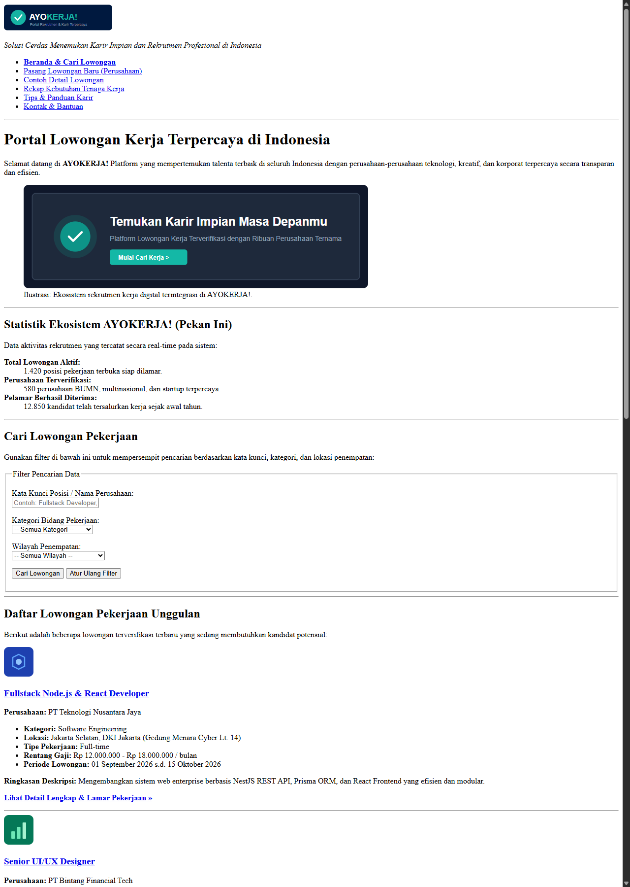
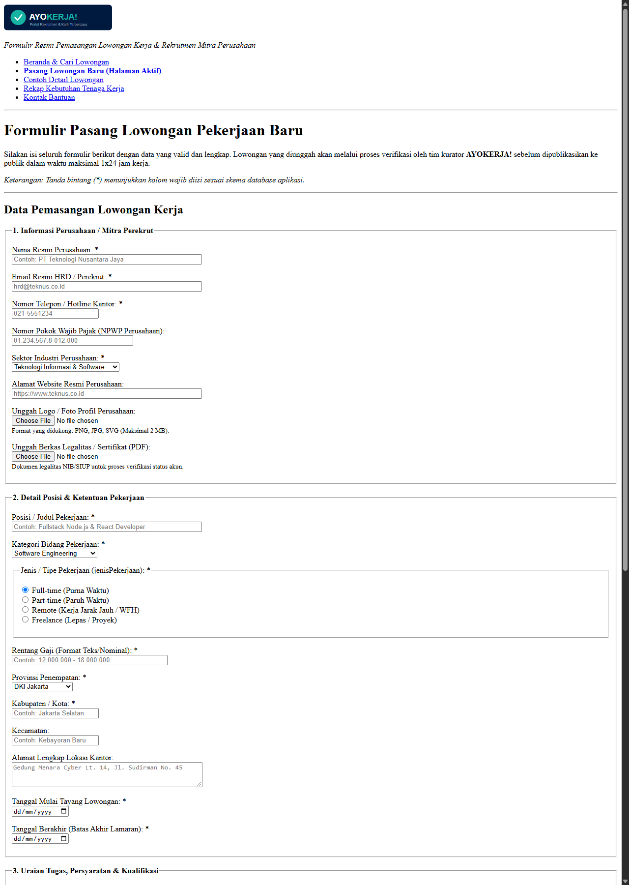
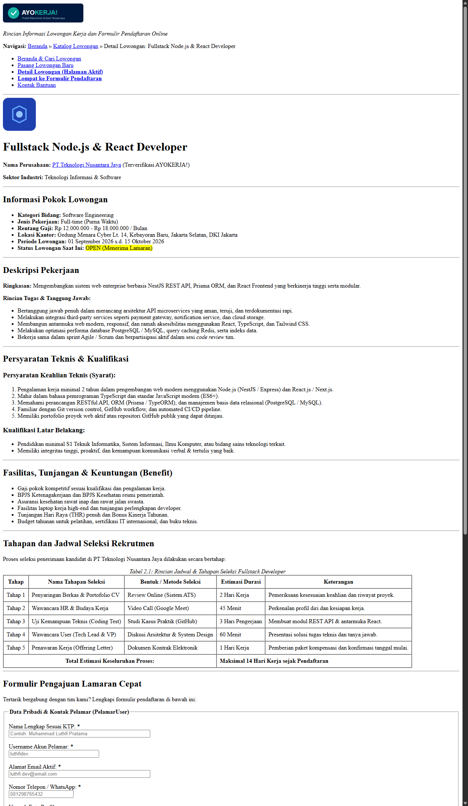

# Tugas Perkuliahan: BAB 2 - HTML Murni (Semantic HTML5 & Aksesibilitas)
**Mata Kuliah:** Pemrograman Web (Web Programming)  
**Cicilan Proyek:** Tahap 1 (Struktur Dasar HTML Murni - Pekan 2)  
**Proyek Lanjutan:** Aplikasi Fullstack (Bertahap s.d. Pekan ke-14)

---

## 1. Studi Kasus Aplikasi: **AYOKERJA!**
**AYOKERJA!** adalah platform portal lowongan kerja dan rekrutmen digital terpadu di Indonesia yang menghubungkan pencari kerja (*job seekers*) dengan perusahaan (*employers*) secara transparan, efisien, dan terverifikasi.

Studi kasus ini dipilih karena memiliki kompleksitas data yang ideal untuk pengembangan bertahap hingga pekan ke-14 (meliputi katalog data, filtering, form multi-input, relasi pelamar-perusahaan, autentikasi, serta dashboard manajemen).

---

## 2. Struktur Direktori Proyek

```text
tugas-bab2-html/
├── assets/                          # Aset gambar vektor & logo lokal
│   ├── banner-hero.svg              # Ilustrasi banner pengantar utama
│   ├── company-creative.svg         # Logo contoh perusahaan kreatif
│   ├── company-data.svg             # Logo contoh perusahaan data
│   ├── company-tech.svg             # Logo contoh perusahaan teknologi
│   └── logo-ayokerja.svg            # Logo identitas platform AYOKERJA!
├── docs/
│   └── screenshots/                 # Tangkapan layar tampilan setiap halaman
│       ├── 01-halaman-utama.png
│       ├── 02-form-tambah-lowongan.png
│       └── 03-detail-lowongan.png
├── detail-lowongan.html             # Halaman 3: Detail Lowongan & Form Lamar Cepat
├── index.html                       # Halaman 1: Halaman Utama & Katalog Lowongan
├── tambah-lowongan.html             # Halaman 2: Form Tambah / Pasang Lowongan Baru
└── README.md                        # Dokumentasi lengkap tugas
```

---

## 3. Rincian Halaman & Komponen HTML yang Diterapkan

Proyek ini terdiri dari **3 halaman HTML murni** yang saling terhubung melalui navigasi hyperlink (`<a href="...">`):

### A. Halaman Utama / Beranda (`index.html`)
* **Fungsi:** Menampilkan identitas platform, navigasi utama, banner pengantar, statistik ekosistem, formulir pencarian/filter data, katalog artikel lowongan pekerjaan unggulan, tabel rekapitulasi kebutuhan tenaga kerja, tips karir pada sidebar (`<aside>`), dan footer kontak.
* **Elemen HTML Utama:**
  * **Semantic HTML5:** `<header>`, `<nav>`, `<main>`, `<section>`, `<article>`, `<figure>`, `<figcaption>`, `<aside>`, `<footer>`, `<address>`.
  * **Headings:** `<h1>` (tunggal untuk judul utama), `<h2>`, `<h3>`.
  * **Data Tabular:** `<table>` dengan `<caption>`, `<thead>`, `<tbody>`, `<tfoot>`, `<tr>`, `<th scope="col/row">`, `<td>`.
  * **Media & List:** `` dengan `alt` deskriptif, `<dl>` (description list data statistik), `<ul>`, `<ol>`.

### B. Formulir Tambah Lowongan (`tambah-lowongan.html`)
* **Fungsi:** Formulir bagi mitra perusahaan untuk memasang lowongan kerja baru.
* **Elemen HTML Utama:**
  * **Form & Fieldset:** `<form>`, `<fieldset>`, `<legend>` untuk membagi kelompok data (Informasi Perusahaan, Detail Posisi, Kualifikasi & Fasilitas, Pernyataan Keabsahan).
  * **Ragam Tipe Input:** `text`, `email`, `tel`, `url`, `file`, `number`, `date`, `radio`, `checkbox`, `textarea`, `<select>`, `<optgroup>`, `<option>`.
  * **Aksesibilitas:** Seluruh input memiliki pasangan `<label for="id">` yang valid secara semantik.
  * **Tombol Aksi:** `<button type="submit">`, `<button type="reset">`, serta tautan pembatalan.

### C. Halaman Detail Lowongan & Lamar Cepat (`detail-lowongan.html`)
* **Fungsi:** Menampilkan informasi komprehensif terkait suatu lowongan (deskripsi, tanggung jawab, kualifikasi, benefit, tabel jadwal tahapan seleksi), profil perusahaan mitra, rekomendasi lowongan serupa, dan formulir pendaftaran lamaran online.
* **Elemen HTML Utama:**
  * **Navigasi Breadcrumb:** `<nav aria-label="Breadcrumb">` untuk navigasi hirarki halaman.
  * **Tabel Jadwal Seleksi:** Tabel tahapan seleksi rekrutmen lengkap dengan estimasi durasi dan metode tes.
  * **Formulir Lamar Cepat:** Form pengisian data pribadi, upload CV (PDF), tautan portofolio/LinkedIn, surat motivasi, dan persetujuan data.

---

## 4. Penerapan Semantic HTML5 & Praktik Aksesibilitas

1. **Semantic HTML5:**
   * Tidak menggunakan `<div>` bertumpuk tanpa makna struktural.
   * Struktur dokumen jelas: `<header>` untuk kepala dokumen/bagian, `<nav>` untuk navigasi, `<main>` untuk konten utama, `<section>` untuk pemisahan topik, `<article>` untuk entitas mandiri (lowongan/tips), `<aside>` untuk konten sampingan pendukung, dan `<footer>` untuk informasi penutup/hak cipta.
2. **Aksesibilitas (a11y):**
   * **Deskripsi Gambar:** Semua tag `` memiliki atribut `alt` yang mendeskripsikan konten visual secara jelas bagi pengguna pembaca layar (*screen reader*).
   * **Relasi Label & Input:** Setiap elemen input form terhubung langsung dengan `<label>` melalui atribut `for` yang sama persis dengan `id` pada input.
   * **Validasi Native:** Menggunakan atribut HTML5 seperti `required`, `pattern`, `min`, `max`, `step`, `accept`, dan `placeholder`.

---

## 5. Tangkapan Layar Tampilan Halaman (HTML Murni)

Berikut adalah dokumentasi tampilan struktur halaman HTML murni sebelum diberikan styling CSS:

### 1. Tampilan Halaman Utama (`index.html`)


### 2. Tampilan Form Tambah Lowongan (`tambah-lowongan.html`)


### 3. Tampilan Halaman Detail & Form Lamar (`detail-lowongan.html`)


---

## 6. Petunjuk Menjalankan / Membuka Proyek

1. Proyek ini dibangun menggunakan **HTML5 standar murni**, sehingga tidak memerlukan instalasi dependensi tambahan untuk dibuka.
2. Cukup klik ganda file `index.html` pada File Explorer untuk membukanya di browser apa pun (Google Chrome, Microsoft Edge, Mozilla Firefox, dll), atau gunakan ekstensi *Live Server* pada VS Code / Antigravity IDE.
3. Semua tautan navigasi (`<a>`) antar halaman telah terhubung secara relatif dan dapat diuji secara langsung.

---

## 7. Rencana Pengembangan Selanjutnya (Pekan 3 s.d. Pekan 14)
* **Minggu 3:** Penerapan CSS Murni (Color palette, Flexbox, CSS Grid, Typography, Responsive Layout).
* **Minggu 4:** Penerapan Framework CSS (Tailwind CSS / Bootstrap).
* **Tahap Lanjutan:** Integrasi JavaScript interaktif, React/Vite, REST API Backend, Database, serta Autentikasi Pengguna sampai Pekan 14.
