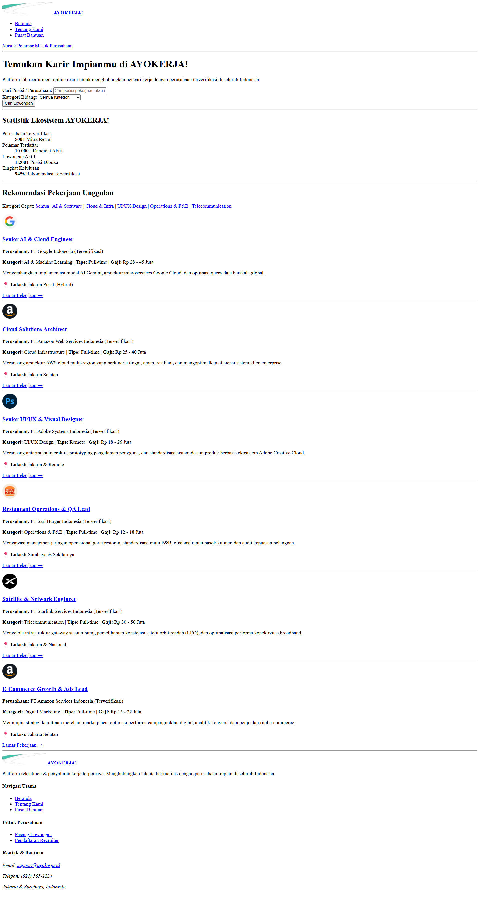
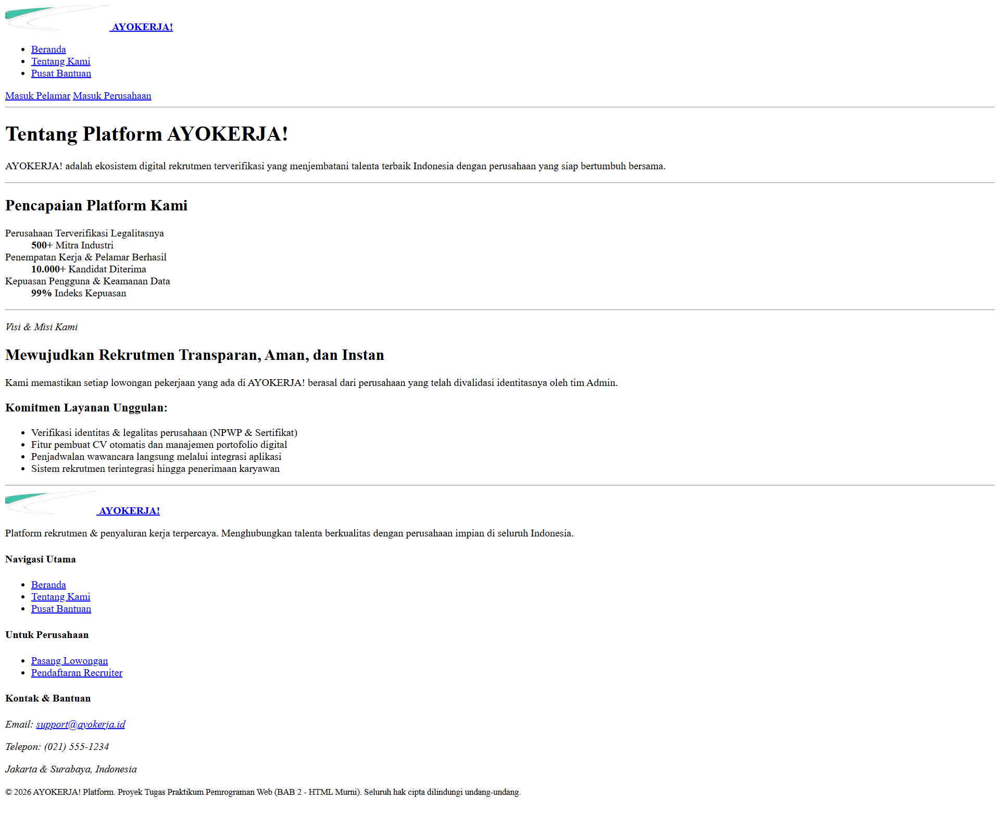
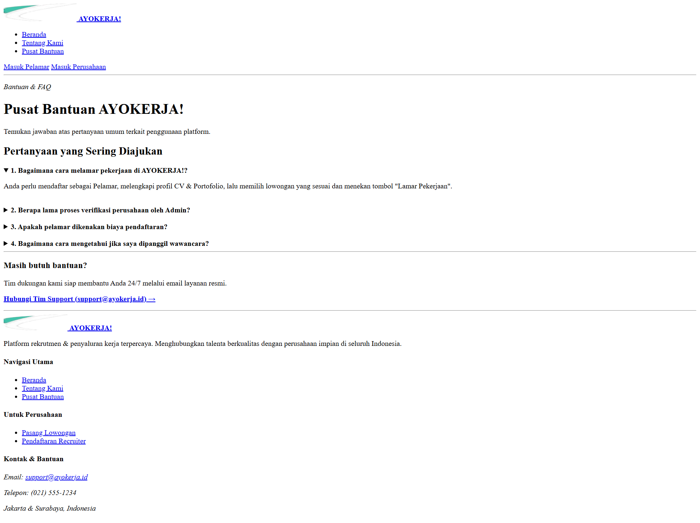

# Dokumentasi Tugas Pemrograman Web
## BAB 2 - Penerapan Struktur Semantic HTML5 & Aksesibilitas

**Nama Mahasiswa / Repositori:** tugasWEBPRO  
**Studi Kasus Proyek Fullstack:** **AYOKERJA!** (Portal Rekrutmen & Penyaluran Kerja Terpadu Indonesia)  
**Tautan Repositori GitHub:** [https://github.com/hydenn11/tugasWEBPRO](https://github.com/hydenn11/tugasWEBPRO)

---

## 1. Deskripsi Proyek
Tugas ini menerapkan **HTML5 Murni Semantik** tanpa stylesheet CSS eksternal pada 3 halaman antarmuka web portal lowongan kerja **AYOKERJA!**:
1. **Beranda (`index.html`)** — Katalog lowongan pekerjaan, pencarian, dan metrik statistik.
2. **Tentang Kami (`about.html`)** — Profil platform dan visi misi.
3. **Pusat Bantuan (`support.html`)** — Accordion FAQ native (`<details>/<summary>`) dan tautan kontak.

---

## 2. Struktur Direktori

```text
tugas_bab2_html/
├── assets/                               # Aset gambar & logo perusahaan
│   ├── company-adobe.png
│   ├── company-amazon.png
│   ├── company-burgerking.png
│   ├── company-google.png
│   ├── company-spacex.png
│   └── logo.png
├── docs/
│   └── screenshots/                      # Dokumentasi Tangkapan Layar
│       ├── 01-beranda-html.png
│       ├── 02-tentang-kami-html.png
│       └── 03-pusat-bantuan-html.png
├── about.html                            # Halaman Tentang Kami
├── index.html                            # Halaman Beranda
├── support.html                          # Halaman Pusat Bantuan
└── README.md                             # Dokumentasi Tugas
```

---

## 3. Tangkapan Layar Halaman (Screenshots)

#### 1. Halaman Beranda (`index.html`)


#### 2. Halaman Tentang Kami (`about.html`)


#### 3. Halaman Pusat Bantuan (`support.html`)


---

## 4. Cara Menjalankan
Buka file `index.html` pada browser apa pun (Google Chrome, Microsoft Edge, Mozilla Firefox, dll).

---


