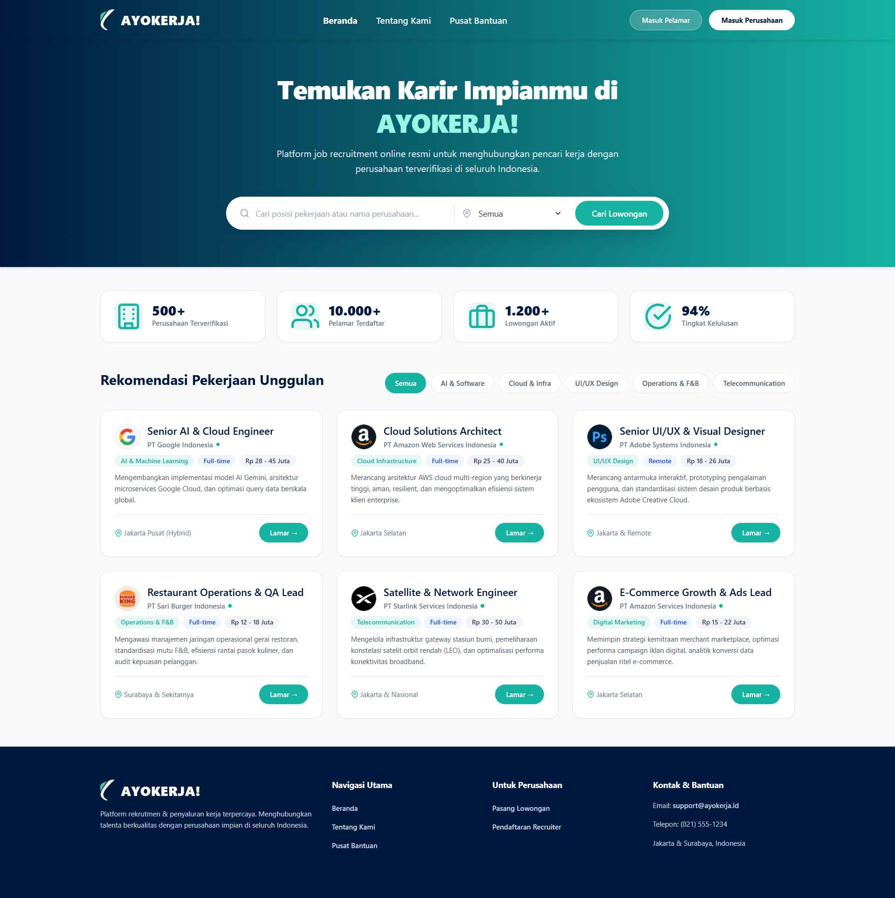
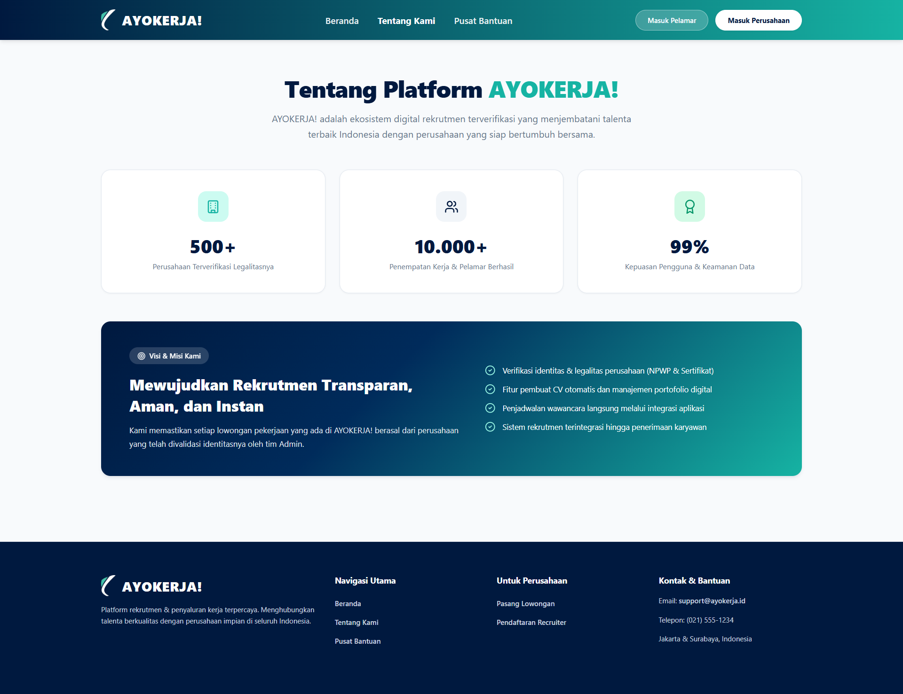
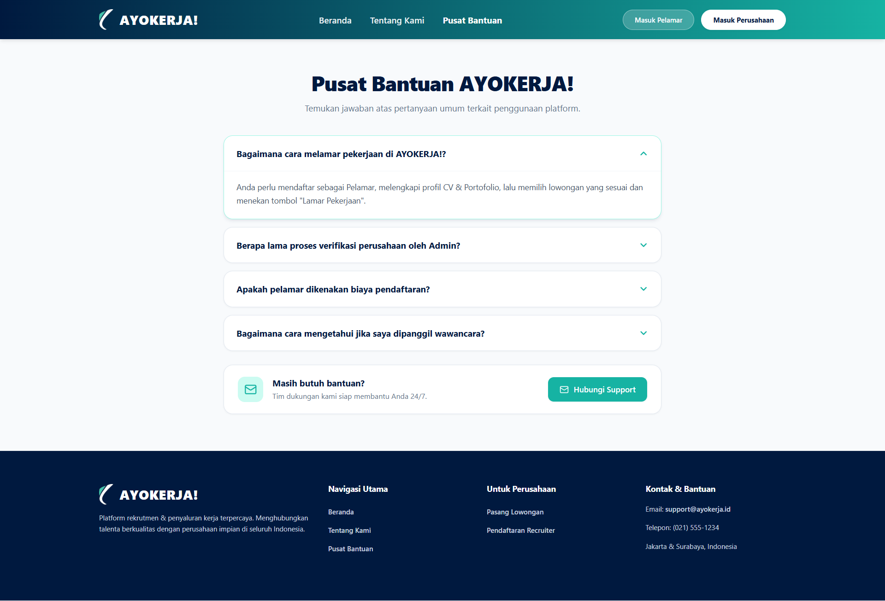
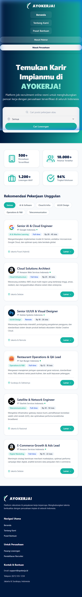
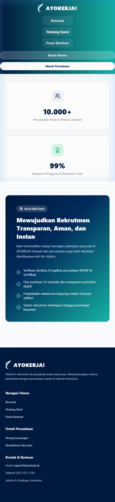
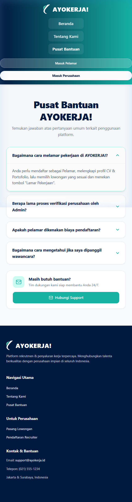

# Dokumentasi Tugas Pemrograman Web
## BAB 3 - Penerapan CSS Murni (Native CSS3 & Responsive Layout)

**Nama Mahasiswa / Repositori:** tugasWEBPRO  
**Studi Kasus Proyek Fullstack:** **AYOKERJA!** (Portal Rekrutmen & Penyaluran Kerja Terpadu Indonesia)   
**Tautan Repositori GitHub:** [https://github.com/hydenn11/tugasWEBPRO](https://github.com/hydenn11/tugasWEBPRO)

---

## 1. Deskripsi Proyek
Tugas ini menerapkan **CSS Native murni** melalui file external stylesheet (`style.css`) pada 3 halaman antarmuka web portal lowongan kerja **AYOKERJA!**:
1. **Beranda (`index.html`)** — Katalog lowongan pekerjaan unggulan, search bar, dan metrik statistik.
2. **Tentang Kami (`about.html`)** — Profil platform dan komitmen visi misi.
3. **Pusat Bantuan (`support.html`)** — Accordion FAQ pertanyaan umum dan kontak support.

---

## 2. Struktur Direktori

```text
tugas_bab3_css/
├── assets/                               # Aset gambar & logo perusahaan
│   ├── company-adobe.png
│   ├── company-amazon.png
│   ├── company-burgerking.png
│   ├── company-google.png
│   ├── company-spacex.png
│   └── logo.png
├── docs/
│   └── screenshots/                      # Dokumentasi Tangkapan Layar
│       ├── 01-desktop-beranda.png
│       ├── 02-desktop-tentang-kami.png
│       ├── 03-desktop-pusat-bantuan.png
│       ├── 04-mobile-beranda.png
│       ├── 05-mobile-tentang-kami.png
│       └── 06-mobile-pusat-bantuan.png
├── about.html                            # Halaman Tentang Kami
├── index.html                            # Halaman Beranda
├── support.html                          # Halaman Pusat Bantuan
├── style.css                             # External Stylesheet CSS
└── README.md                             # Dokumentasi Tugas
```

---

## 3. Tangkapan Layar Halaman (Screenshots)

### A. Tampilan Desktop

#### 1. Halaman Beranda (`index.html`)


#### 2. Halaman Tentang Kami (`about.html`)


#### 3. Halaman Pusat Bantuan (`support.html`)


---

### B. Tampilan Mobile Responsive (`@media screen`)

#### 4. Mobile Beranda


#### 5. Mobile Tentang Kami


#### 6. Mobile Pusat Bantuan


---

## 4. Cara Menjalankan
Buka file `index.html` pada browser apa pun (Google Chrome, Microsoft Edge, Mozilla Firefox, dll).

---

